# 📖 BalloonFly Use Cases

Comprehensive guide to all user flows and scenarios in BalloonFly.

---

## 👤 User Personas

### 1. 🎮 Casual Player

- Plays for fun with small bets
- Prefers safe, early cash-outs
- Enjoys social aspect (watching others)

### 2. 💎 High Roller

- Places large bets
- Takes calculated risks
- Studies patterns and history

### 3. 🤖 Auto-Better

- Uses automatic betting strategies
- Sets predefined cash-out multipliers
- Focuses on long-term profit

### 4. 🔍 Verifier

- Checks provably fair results
- Validates on-chain data
- Ensures game integrity

---

## 🎯 Core Use Cases

### UC-01: Connect Wallet & Start Playing

**Actor:** New Player

**Flow:**

1. Player visits landing page (/)
2. Clicks "Play Now" or "Connect Account"
3. Selects wallet (Freighter, xBull, etc.)
4. Approves connection
5. **Auto-redirected to /game** ✨
6. Sees game interface with current round

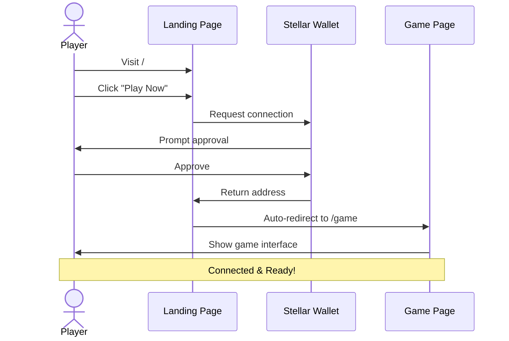

**Success Criteria:**

- ✅ Wallet connected successfully
- ✅ Balance displayed in header
- ✅ Player can see live game

---

### UC-02: Place a Bet (Manual)

**Actor:** Connected Player

**Preconditions:**

- Wallet connected
- Sufficient XLM balance
- Round in "Waiting" or "Flying" phase

**Flow:**

1. Player enters bet amount (e.g., 10 XLM)
2. Optionally sets auto cash-out multiplier
3. Clicks "Place Bet"
4. Wallet prompts for signature
5. Player approves transaction
6. Bet confirmed on-chain
7. Player's bet appears in "Live Bets" list

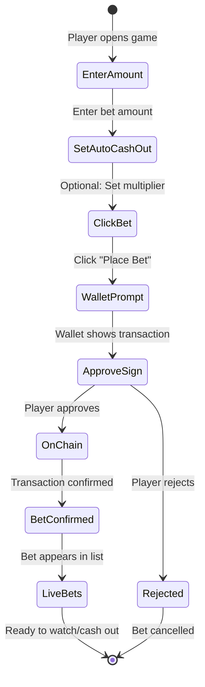

**Edge Cases:**

- 🔄 **Bet during flight:** Goes to next round (queued)
- ❌ **Insufficient balance:** Error message shown
- ⏰ **Round ends:** Bet rejected, try next round

**Success Criteria:**

- ✅ Bet recorded on-chain
- ✅ Balance updated
- ✅ Bet visible in sidebar

---

### UC-03: Cash Out Before Crash

**Actor:** Player with Active Bet

**Preconditions:**

- Player has active bet in current round
- Round is "Flying"
- Balloon hasn't crashed yet

**Flow:**

1. Player monitors multiplier (e.g., 1.00x → 2.45x)
2. Decides to cash out at 2.45x
3. Clicks "Cash Out" button
4. Transaction submitted instantly
5. Winnings calculated: `10 XLM × 2.45 × (1 - 3% fee) = 23.76 XLM`
6. Balance updated immediately
7. Bet marked as "Cashed Out" in list

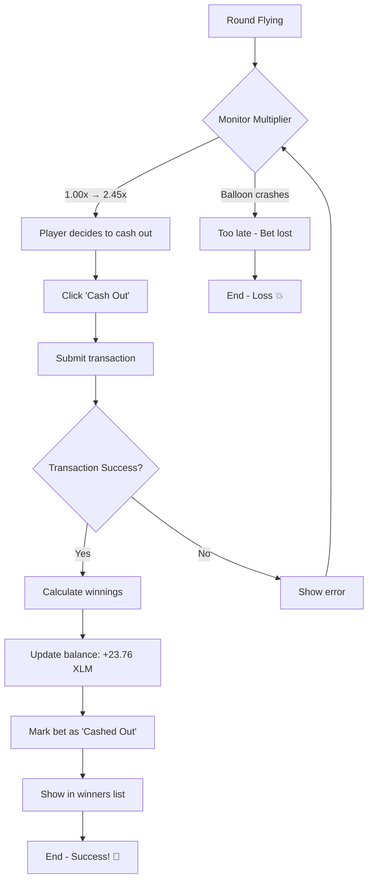

**Success Criteria:**

- ✅ Cash-out processed before crash
- ✅ Correct winnings received
- ✅ Bet status updated

---

### UC-04: Lose When Balloon Crashes

**Actor:** Player with Active Bet

**Preconditions:**

- Player has active bet
- Player hasn't cashed out

**Flow:**

1. Round is flying (e.g., 1.00x → 3.89x)
2. Balloon crashes at 3.89x 💥
3. All uncashed bets lose
4. Player's bet marked as "Lost"
5. Balance unchanged (bet already deducted)
6. New round starts after countdown

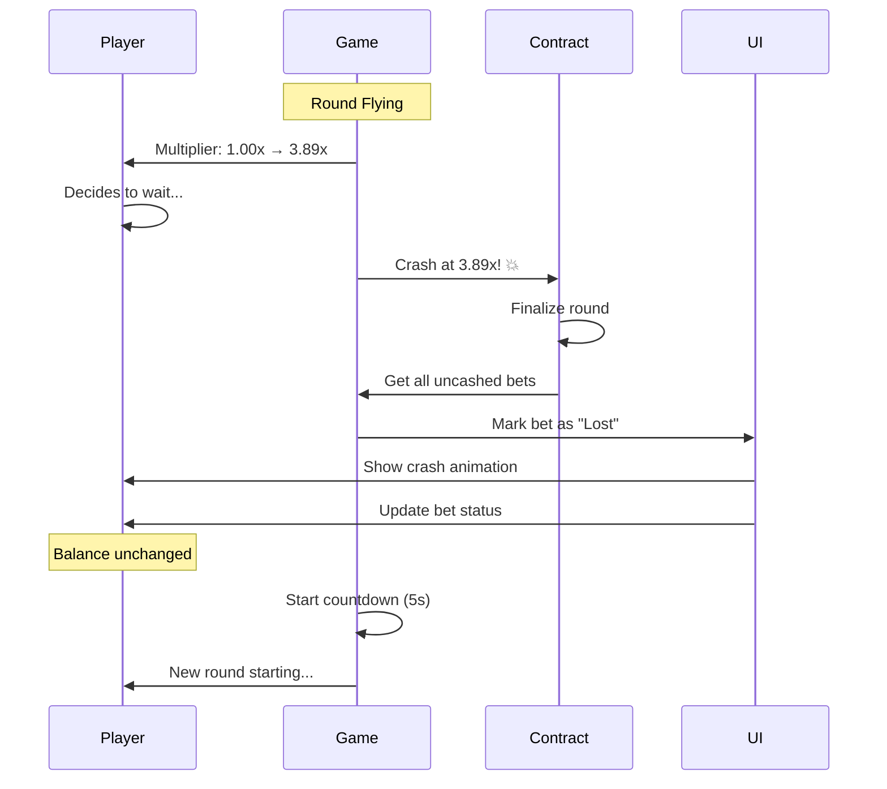

**Success Criteria:**

- ✅ Bet marked as lost
- ✅ No payout received
- ✅ Player can bet in next round

---

### UC-05: Auto-Bet with Target Multiplier

**Actor:** Strategic Player

**Preconditions:**

- Wallet connected
- Sufficient balance for multiple rounds

**Flow:**

1. Player switches to "Automatic" tab
2. Sets bet amount: `5 XLM`
3. Sets auto cash-out: `2.00x`
4. Enables auto-bet
5. **System automatically:**
   - Places 5 XLM bet each round
   - Cashes out at exactly 2.00x (if reached)
   - Loses bet if crash happens before 2.00x
6. Player can stop anytime

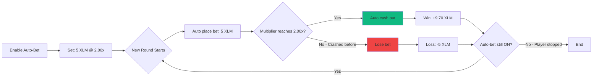

**Success Criteria:**

- ✅ Bets placed automatically
- ✅ Cash-outs at exact multiplier
- ✅ Player can monitor performance

---

### UC-06: View Round History

**Actor:** Any Player

**Flow:**

1. Player scrolls to top of game screen
2. Sees horizontal strip of recent multipliers
3. Multipliers color-coded:
   - 🔵 **Blue**: 1.00x - 1.99x (common)
   - 🟣 **Purple**: 2.00x - 9.99x (medium)
   - 🔴 **Red**: 10.00x+ (rare)
4. Clicks any multiplier
5. Modal opens with round details

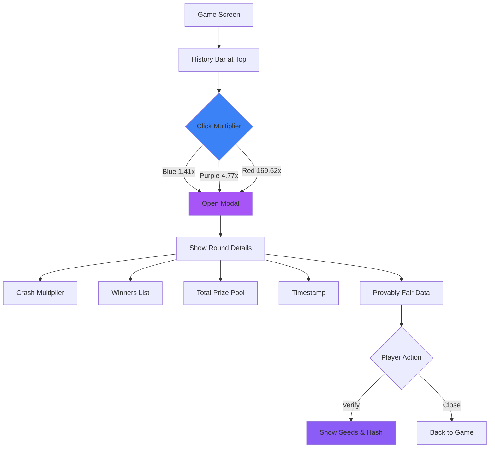

**Success Criteria:**

- ✅ History visible and updated
- ✅ Color-coding correct
- ✅ Details accessible

---

### UC-07: Verify Provably Fair Result

**Actor:** Skeptical Player

**Preconditions:**

- Round has ended

**Flow:**

1. Player clicks "🔒 Provably Fair" button
2. Modal shows:
   - Server seed hash (pre-published)
   - Revealed server seed (after crash)
   - Client seeds (from first 3 bets)
   - Combined hash
   - Crash multiplier calculation
3. Player can verify independently:
   ```javascript
   hash = SHA256(serverSeed + clientSeed1 + clientSeed2 + clientSeed3);
   multiplier = calculateFromHash(hash);
   ```
4. Player confirms calculation matches
1. Player clicks round details or inspects `RoundDetailsModal`
2. Modal shows the on-chain recorded round data:
   - **Server Seed Hash**: The 32-byte SHA256 commitment published prior to betting
   - **Client Seeds**: Entropy contributed by players during the betting window
   - **Result**: The deterministic crash multiplier recorded on-chain
   - **Round Stats**: Total bets and total XLM wagered
3. Player confirms cryptographic commitment:
   - The contract verifies `SHA256(server_seed) == server_seed_hash` when starting the round, binding the operator before client seeds are gathered.
   - **Note on Revealed Seed**: In the current contract version (`contracts/balloonfly`), `server_seed_hash` is permanently recorded in contract storage, but the raw `server_seed` preimage is verified and discarded during `start_round` without being written to contract storage. Full client-side re-derivation requires the operator to publish the raw seed off-chain, or for a future contract upgrade to store `server_seed` in `Round` upon `finalize_round`.

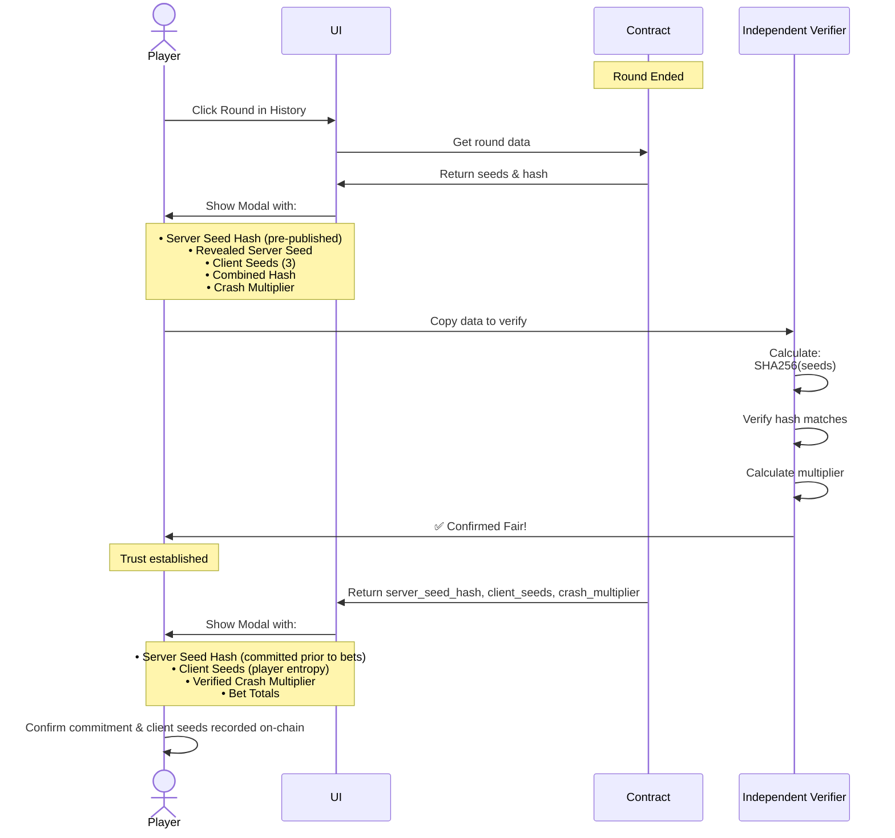

**Success Criteria:**

- ✅ All seeds visible
- ✅ Hash calculation correct
- ✅ Multiplier verifiable
- ✅ Server seed hash commitment visible
- ✅ Client seeds recorded on-chain
- ✅ Crash multiplier verifiable on-chain

---

### UC-08: Watch Live Game (Spectator)

**Actor:** Visitor without Wallet

**Flow:**

1. Visitor opens /game
2. Sees game running but can't bet
3. Watches:
   - Live multiplier updates
   - Other players' bets
   - Cash-outs in real-time
   - Round history
4. Connects wallet when ready to play

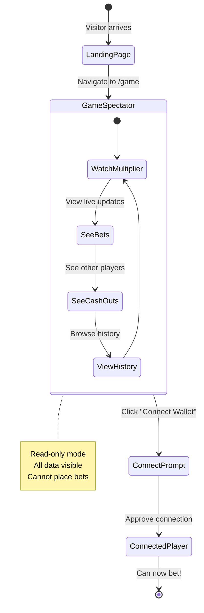

**Success Criteria:**

- ✅ Game visible without connection
- ✅ Live updates work
- ✅ Clear prompt to connect

---

## 🔄 Round Lifecycle

### Detailed Flow

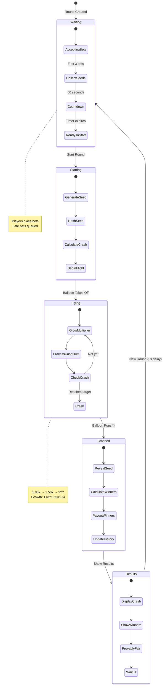

**Phase Durations:**

- ⏰ Waiting: 60 seconds
- ⚡ Starting: < 1 second
- 🎈 Flying: Variable (until crash)
- 💥 Crashed: Instant
- 📊 Results: 5 seconds

---

## 💰 Payout Examples

### Example 1: Early Cash-Out Win

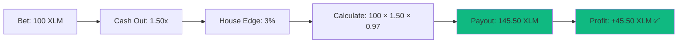

### Example 2: Late Cash-Out Win

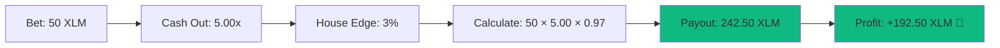

### Example 3: Loss (No Cash-Out)

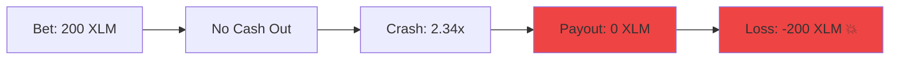

### Example 4: Auto-Bet Strategy (10 rounds)

```
Bet per round: 10 XLM
Auto cash-out: 2.00x
Target: 19.40 XLM per win (10 × 2.00 × 0.97)

Results:
Round 1: Win at 2.00x → +9.40 XLM
Round 2: Crash at 1.85x → -10.00 XLM
Round 3: Win at 2.00x → +9.40 XLM
Round 4: Win at 2.00x → +9.40 XLM
Round 5: Crash at 1.22x → -10.00 XLM
Round 6: Win at 2.00x → +9.40 XLM
Round 7: Win at 2.00x → +9.40 XLM
Round 8: Crash at 1.99x → -10.00 XLM
Round 9: Win at 2.00x → +9.40 XLM
Round 10: Win at 2.00x → +9.40 XLM

Total Profit: +46.40 XLM (7 wins, 3 losses)
```

---

## 🎯 Advanced Scenarios

### Scenario A: Multiple Players Same Round

**Setup:**

- Alice bets 10 XLM
- Bob bets 50 XLM
- Charlie bets 100 XLM
- Crash at 3.50x

```mermaid
gantt
    title Round Timeline - Multiple Players
    dateFormat X
    axisFormat %Lx

    section Alice
    Bet placed (10 XLM)    :0, 10
    Cash out @ 2.00x       :10, 20
    Wins 19.40 XLM         :20, 30

    section Bob
    Bet placed (50 XLM)    :0, 10
    Cash out @ 3.00x       :10, 30
    Wins 145.50 XLM        :30, 40

    section Charlie
    Bet placed (100 XLM)   :0, 10
    Waiting...             :10, 35
    Loses (no cash-out)    :35, 40

    section Round
    Crash @ 3.50x          :crit, 35, 40
```

**Outcome:**

- Alice cashes out at 2.00x → Wins 19.40 XLM ✅
- Bob cashes out at 3.00x → Wins 145.50 XLM ✅
- Charlie doesn't cash out → Loses 100 XLM ❌

### Scenario B: Bet During Flight

**Setup:**

- Round started, multiplier at 1.80x
- Player tries to place bet

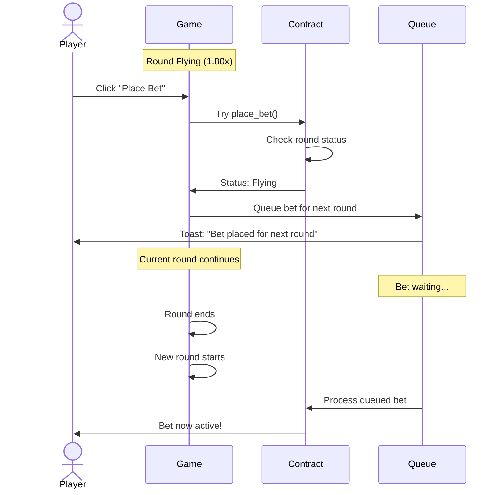

**Outcome:**

- Bet rejected for current round
- Bet queued for next round
- Toast message: "Bet placed for next round"

### Scenario C: Network Disconnect

**Setup:**

- Player has active bet
- Internet disconnects during flight

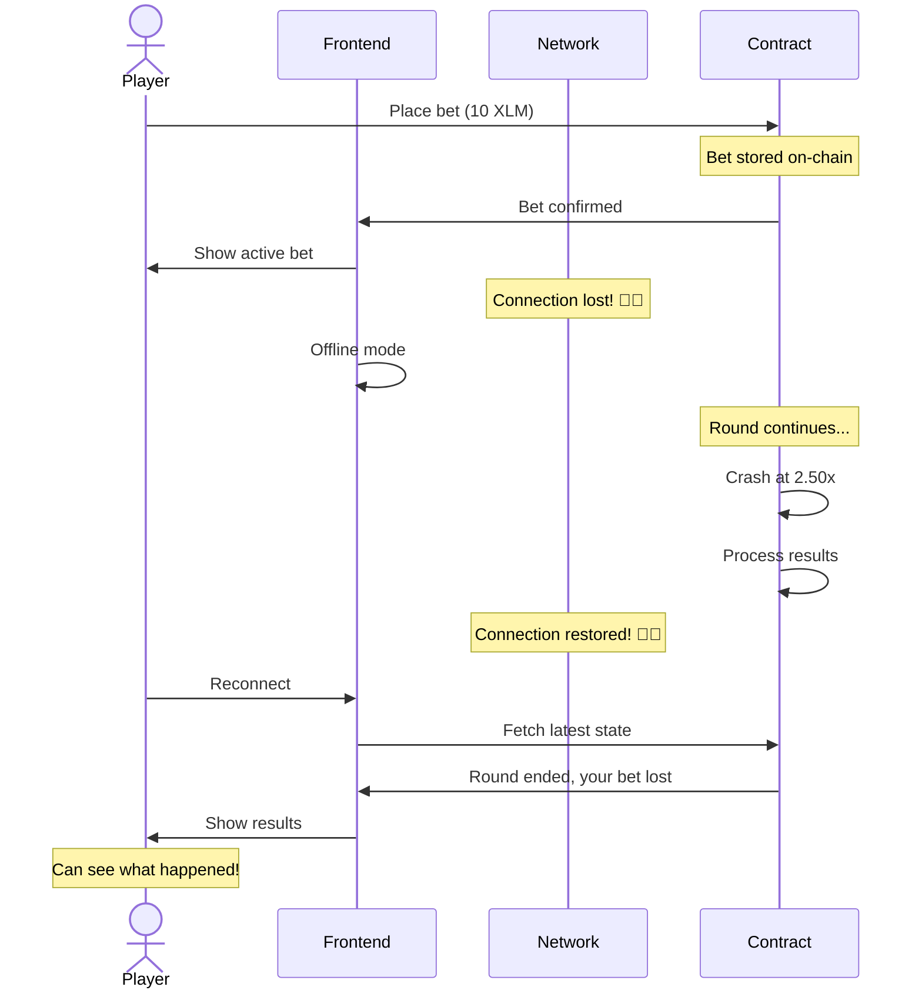

**Outcome:**

- Bet still valid on-chain
- Player can reconnect and continue
- If crashed, result visible after reconnect

---

## 📊 Statistics Tracking

The frontend provides aggregated performance metrics via `StatisticsPanel` across selectable timeframes (**Today**, **7D**, **15D**, **30D**). The displayed metrics match the four cards rendered by the panel:

1. **Paid**: Total amount of XLM won and paid out across ended rounds within the selected window (`sum(total_payout)`).
2. **RTP (Return to Player %)**: Aggregate return percentage computed across ended rounds using the formula `(paid / total_bet_amount) * 100` (or `0` when no bets exist).
3. **Players**: An estimated activity metric (`Math.max(filteredRounds.length * 5, sum(bet_count))`). As noted in the codebase, this is an estimate/placeholder pending a dedicated backend indexer for unique address queries.
4. **Online Now**: A real-time concurrent user indicator currently rendered with placeholder value `0` pending WebSocket or presence event infrastructure.

> **Note on Per-Player Metrics**: Individual player tracking (such as personal win rate %, average cash-out multiplier, personal biggest win, or cumulative player profit/loss) requires wallet-level bet indexing that the smart contract does not currently expose directly. These metrics will be enabled once the backend indexing service is deployed.
Players can track:

- Total bets placed
- Win rate (%)
- Average cash-out multiplier
- Biggest win
- Total profit/loss
- Rounds played

---

## 🔐 Security Use Cases

### SEC-01: Prevent Double Cash-Out

**Attack:** Player tries to cash out twice

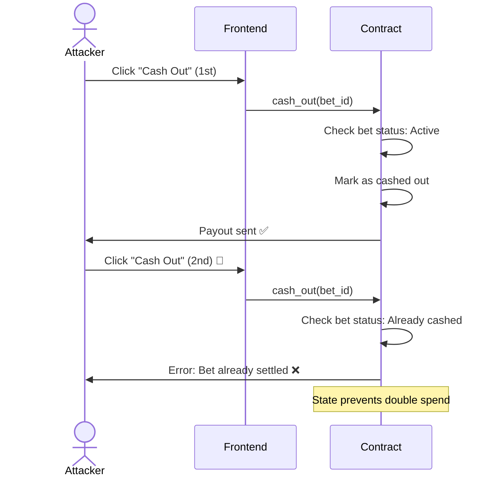

**Prevention:**

- On-chain state checked
- First cash-out invalidates bet
- Second attempt rejected

### SEC-02: Verify Fair Crash

**Scenario:** Player audits game fairness

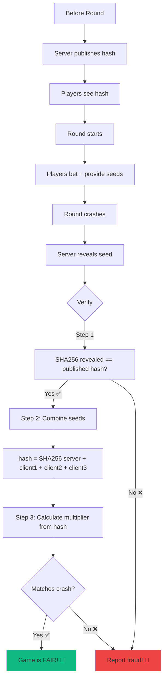

**Solution:**

1. Get server seed hash (before round)
2. Round completes
3. Server seed revealed
4. Verify: `SHA256(revealed) === hash`
5. Calculate multiplier from seeds
6. Confirm crash was predetermined
    A[Before Round] --> B[Server commits server_seed_hash]
    B --> C[Players observe committed hash on-chain]
    C --> D[Players bet and contribute client seeds]
    D --> E[Contract verifies SHA256 server_seed == hash on start]
    E --> F[Round crashes at deterministic multiplier]
    F --> G[On-chain state stores hash, client seeds, multiplier]
    G --> H{Audit}
    H -->|Commitment Enforced| I[Operator cannot alter outcome after bets ✅]
    H -->|Seed Preimage| J[Retained off-chain by operator / future contract upgrade]

    style I fill:#10b981
    style J fill:#f59e0b
```

**Verification Details:**

1. **Pre-Bet Commitment**: Server publishes `server_seed_hash` before any bets are placed or client seeds are received.
2. **Contract Enforced Check**: When `start_round` is called, the contract computes `SHA256(server_seed)` and requires it to equal `server_seed_hash`.
3. **Entropy Injected**: Player-submitted client seeds are bound to the round state on-chain.
4. **Preimage Storage Status**: Currently, `Round` in the contract stores `server_seed_hash: BytesN<32>` and `client_seeds: Vec<BytesN<32>>`, but does not store the raw `server_seed` preimage on-chain. Independent zero-knowledge recalculation of the crash formula requires the operator to reveal the preimage off-chain (or a future contract upgrade to persist `server_seed` in `Round` on `finalize_round`).

---

## 🎓 Learning Path

### Beginner

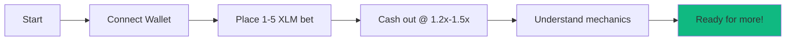

### Intermediate

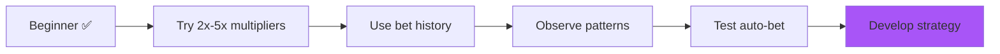

### Advanced


---

**Ready to play? Check [QUICK_START.md](./QUICK_START.md)!** 🎈
